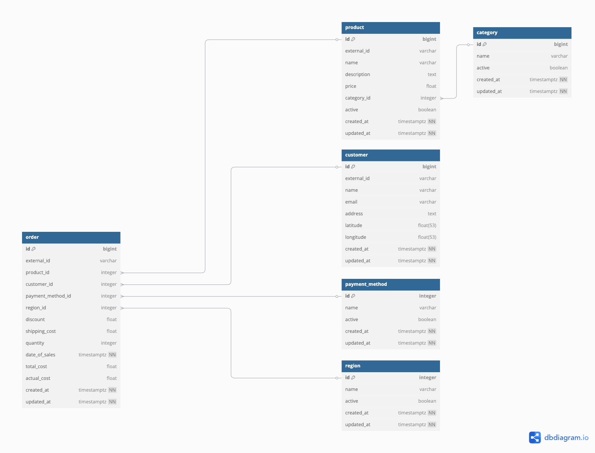

# Setup

## requirements
- node version: v22.14.0, npm version:10.9.2
- postgres

## env setup
- copy .env.example as .env
- update the values in .env filel

## install dependecies
```bash
npm install
```

## run the project
```bash
npm run setup
```
run this command to setup the migration

```bash
npm run dev
```
to run the project

postman collection is added to root of the project


# About Project
## DB Schema Design
Link to [Database Design](https://dbdiagram.io/d/Product-Dashboard-6805e9e51ca52373f5b386fe)




## Code Structure
```
src/
    config/ -- setting for the application like database
    controller/
    middlware/
    models/
    repositories/
    routes/ -- has routes defined for the analytics endpoints
    services/
    workers/
    
```

# Api Documentation

## Overview
This document provides detailed information about the available API endpoints for the Product Dashboard application.

## Authentication
All endpoints require authentication via token. Include the token in the request headers.

## Endpoints

| Method | Endpoint | Authentication | Parameters | Description |
|--------|----------|----------------|------------|-------------|
| POST | `/import` | Required | `startDate`, `endDate` | Import data for the specified date range |
| POST | `/import/upload` | Required | `startDate`, `endDate` | Upload and import data for the specified date range |

### Revenue Analysis
| Method | Endpoint | Authentication | Parameters | Description |
|--------|----------|----------------|------------|-------------|
| GET | `/analysis/revenue/total` | Required | `startDate`, `endDate` | Get total revenue for the specified period |
| GET | `/analysis/revenue/products` | Required | `startDate`, `endDate`, `productId` | Get revenue breakdown by products |
| GET | `/analysis/revenue/categories` | Required | `startDate`, `endDate`, `categoryId` | Get revenue breakdown by categories |
| GET | `/analysis/revenue/regions` | Required | `startDate`, `endDate`, `regionId` | Get revenue breakdown by regions |

### Product Analysis
| Method | Endpoint | Authentication | Parameters | Description |
|--------|----------|----------------|------------|-------------|
| GET | `/analysis/products/top` | Required | `startDate`, `endDate` | Get top performing products |
| GET | `/analysis/products/top/category` | Required | `startDate`, `endDate`, `categoryId` | Get top products by category |
| GET | `/analysis/products/top/region` | Required | `startDate`, `endDate`, `regionId` | Get top products by region |

### Customer & Order Analysis
| Method | Endpoint | Authentication | Parameters | Description |
|--------|----------|----------------|------------|-------------|
| GET | `/analysis/customers/count` | Required | `startDate`, `endDate` | Get total customer count |
| GET | `/analysis/orders/count` | Required | `startDate`, `endDate` | Get total order count |
| GET | `/analysis/orders/average-value` | Required | `startDate`, `endDate` | Get average order value |

### Business Metrics
| Method | Endpoint | Authentication | Parameters | Description |
|--------|----------|----------------|------------|-------------|
| GET | `/analysis/profit-margin` | Required | `startDate`, `endDate` | Get profit margin analysis |
| GET | `/analysis/customer-lifetime-value` | Required | `startDate`, `endDate` | Get customer lifetime value analysis |
| GET | `/analysis/customer-segmentation` | Required | `startDate`, `endDate` | Get customer segmentation analysis |

## Parameters
- `startDate`: Start date for the analysis period (format: YYYY-MM-DD)
- `endDate`: End date for the analysis period (format: YYYY-MM-DD)

## Notes
- All date parameters are required for each endpoint, else it will defaults to current month
- Ensure proper authentication token is included in the request headers
- Date ranges should be valid and logical (end date should be after start date) 